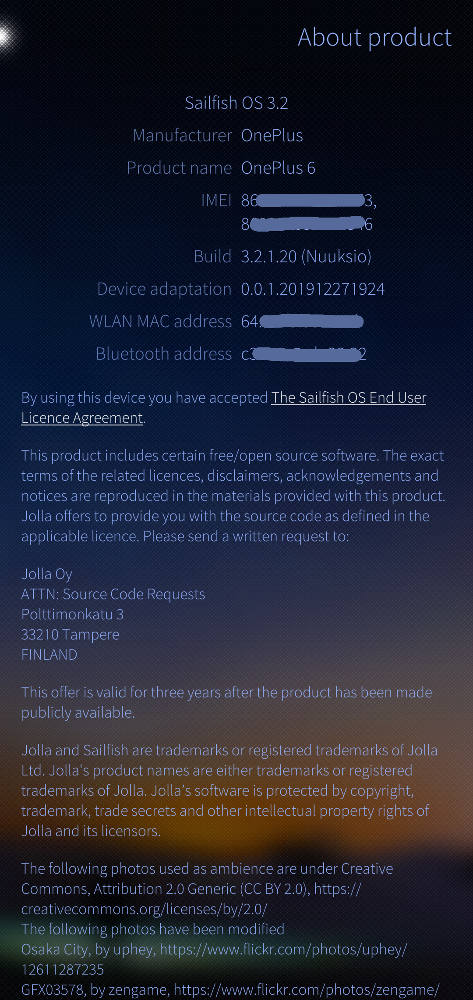

# sf-enchilada

A repo containing all useful general information for porting to the OnePlus 6 / enchilada.

## [Build Guide](building.md)

# Issues

Please use this repository for all issues with functionality on the device or with porting, I'm always trying to improve my device specific guide. If you have a problem please feel free to [create an issue](https://github.com/sailfish-oneplus6/sf-enchilada/issues/new)

## When creating an issue

### Include

* Output of `journalctl -b`
* Output of `logcat`
* Output of `dmesg`

# Releases

All releases will be [posted here](https://github.com/sailfish-oneplus6/sf-enchilada/releases), watching this repo will cause you to be notified every time I release a new version!

# Pull Requests

We all love a good PR, if you feel like contributing to this project feel free to checkout the [Trello board](https://trello.com/b/xHiboUsv/sfos-enchilada) for things that need to be done.
Please include a detailed description along with your PR.